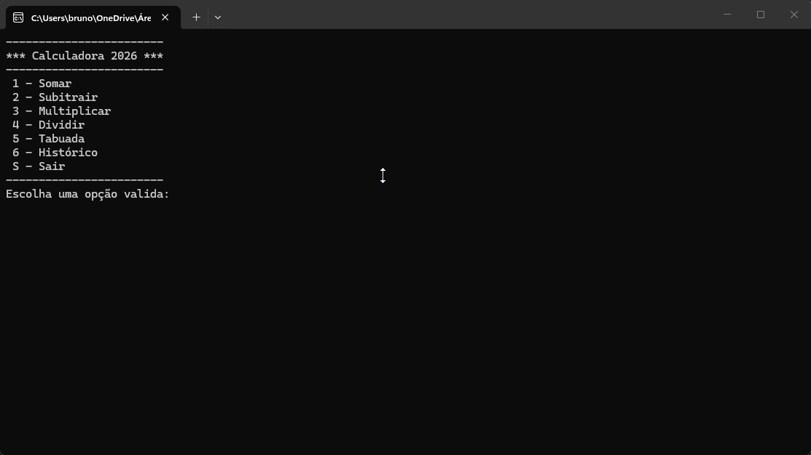

# Calculadora



## Projeto

Desenvolvido durante o curso Back-End da [Academia do Programador](https://www.academiadoprogramador.net/) 2026.

## Introdução

Uma calculadora de console simples, que permite realizar quatro operações matemáticas, além da visualização do histórico de operações e a visualçização da tabuada.

## Funcionalidade

- **Operações básicas**: Realize somas, subtrações, multiplicações, divisões de forma fácil;

- **Tabuada**: A calculadora também é  capaz de gerar tabuadas. De modo que o operador informa o número o qual deseja e o número que sera denominado como multiplicador;

- **Histórico de operações**: A calculadora é capaz de armazenar na memória um histórico de operações realizadas anteriormente

## Como utilizar o programa

1. Clone ou baixo os arquivos do repositório.
2. Abra o seu emulador de terminal de preferênciua e navegue até a pasta raiz do projeto baixado.
3. Utilize o comando abaixo para restaurar as dependências do projeto.

```
dotnet restore
```
4. Em seguida compile e execute o projeto com o comando:

```
dotnet run --project Calculadora.ConsoleApp
```

## Requisitos

- .NET 10.0 SDK.